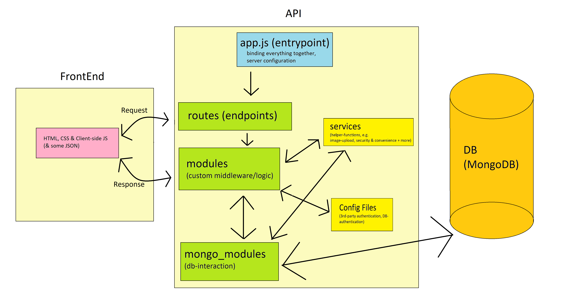

# mySiteFinal - Final version of the site

This site started as a silly hobby project way back when - in fact, it started because of the zombie-part of the site. That part (which started out purely as HTML and CSS, without even JavaScript) was some of the first code I ever wrote. Throughout time (and through about 10-20 different versions) it evolved to what it is now. 

**DISCLAMER - two things to note right away**

1. My passion lies in developing an applications BackEnd - which is why my work on the FrontEnd/User Interface has been minimal. 
2. Much of what this project contains is most certainly not production-ready, however - it is not supposed to be. It is supposed to fulfill two general purposes: 
    1. Serve to let me gain experience and training
    2. Serve as a kind of ("boiler-plate") template, whose components I re-use in various kinds of future projects 
3. As for the MongoDB part of the BackEnd, specifically - this is not done in the correct way. When I started programming, I was using an SQL database for storing data rather than a NoSQL one. When I started using MongoDB (and mongoose.js) I failed to properly comply to how it is supposed to be used. Done correctly, all the database access calls would be within the database-models themselves, and could be used very differently. Arguably, that would have generally been much better, for various different reasons (readability, accessibility, coupling/cohesion & re-usability amongst others). Knowing this, the reason why I haven't, lies mostly within it being a habit to do it like this. 

## Purpose of this project

**This site served as a way for me to play around with and gain experience with a wide range of aspects of Node.js, as well as client-side JavaScript. This includes among others**

 - Node.js as general runtime/framework for this project
 - Express.js as framework for both the API and management of frontend navigation, page-rendering etc
 - MongoDB for storing permanent information
 - Reading and Writing local (JSON) files server-side

**Among the most prominent aspects that i have worked with on this projects are the following:** 

 - User LogIn/LogOut & varios forms of authentication, including both local and third-party using passport.js (facebook, google & github)
 - "Security" such as hashing of passwords using the npm crypto module
 - Implemented my own forum, where users can create threads and post comments. Includes various statistics like number of threads per sub-forum, posts per thread, when the last post was made, who made it etc etc
 - Practiced various different kinds of CRUD operations (both client & server side). This includes both editing of personal information via a users profile, as well as editing of general information via a control panel.  
    - This also includes both practicing of both client-side and server-side validation, as well as validation-feedback to the user. 
 - Providing users with the ability to subscribe to newsletters. There is no actual newsletter, but the simulation of subscribing and un-subscribing is complete, including getting e-mails on whatever actual legitimate personal e-mail account that the user enters and using those to verify the subscription, getting information about having verified it and being able to unsubscribe again. 
 - Upload, Download & Resizing of images, as well as various kinds of validation. 
 - Logging of varios kinds of actions (just to simulate and nothing that would actually make sense in production)
 - Using JSON files to manage and dynamically load various kinds of ressources - among which are 
    - Breadcrumbs
    - Client-side JS files
    - CSS files

## Illustration of the site's/API's overall structure

For the sites overall architecture, I attempted to comply with the concepts of low coupling and high cohesion; effectively, designing the API and the overall server structure to be as modular as possible. This in an attempt to maximize maintainability and re-usability. 

